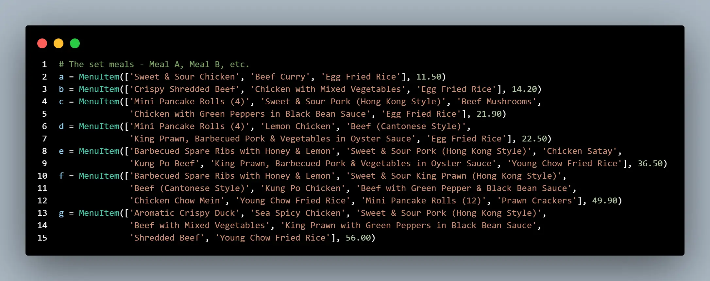
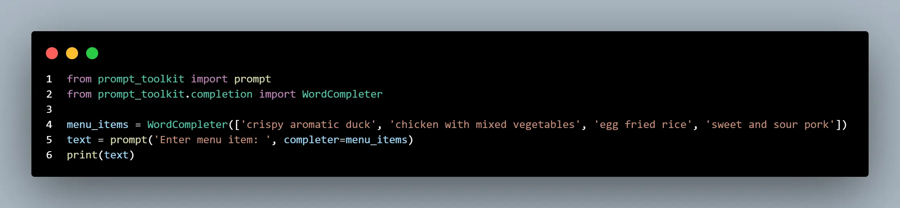

# Cuisine Command

Cuisine Command is a Python command line application for use by a takeaway restaurant.

## Development

### Consulting mentor

I had a meeting with my Code Institute mentor, Rahul Lakhanpal. Out of four project ideas that I suggested, he advised that the takeaway restaurant ordering system was likely the best option for showing my abilities and for trying to create a product with some potential for real-world application and value. I was inclined to agree.

When I raised the apparent requirement for the project to include classes, he suggested that the menu items and the orders received could be suitable for treatment as classes.

He also mentioned [Ascii Art Generator](https://www.ascii-art-generator.org), [Tabulate](https://pypi.org/project/tabulate), [Colorama](https://pypi.org/project/colorama), and [Cerberus](https://docs.python-cerberus.org), for me to look at and consider making use of.

### Setting up

I created a GitHub repository from Code Institute's [project template](https://github.com/Code-Institute-Org/p3-template), cloned my repository, and created a virtual environment.

I created a Google Sheets spreadsheet.

I created a Google Cloud project, enabled a Google Drive API, created credentials and a service account, and created a JSON key. I also enabled a Google Sheets API.

I dragged the file of the JSON key into my workspace, renamed it 'creds', copied the client email address from it, shared my spreadsheet to that address, and added 'creds.json' to the gitignore.

I installed gspread and google-auth in my workspace and imported them in the Python script. I pasted in the SCOPE constant, as I had used during Code Institute's "Love Sandwiches" walkthrough project. I used methods of Credentials (from google-auth) and of gspread to give my application access to the external spreadsheet, as demonstrated in the walkthrough project.

After the commit, I realised that I had supplied an incorrect name of the spreadsheet to be opened, but it was easily edited and recommitted.

### Creating classes

I added 'Name', 'Items ordered', and 'Cost' column headings to my spreadsheet.

I created the MenuItem and Order classes. I defined the confirm method of the Order class. I added temporary dummy instances and a printed method call to test run the script so far, as captured from line 43 onward in my repository's fourth commit (the first commit on Mar 27, 2024).

### ~~Creating instances~~ Adding menu.py

I had created multiple instances of the MenuItem class. For realism and convenience, I based my foods and prices on a menu leaflet from a local takeaway restaurant.

(This screen capture was taken with VS Code's CodeSnap extension, published by adpyke.)

However, I then had a couple of ideas that would impact the development of my project:

- I questioned whether creating a huge number of instances when `run.py` first runs is the best approach, or whether dictionaries would be more suitable for the menu.

- It occurred to me that it should be possible to put the menu in a separate Python file and import it, avoiding cluttering up the main script.

I experimented by adding Meal A and Meal B as a dictionary of dictionaries, followed by a temporary

`print(menu_items['Meal A']['foods'][0])`

and then ran the script. As predicted, the terminal printed 'Sweet & Sour Chicken'. I then created `menu.py` , moved the dictionary into it, added an import at the top of `run.py` , and ran it again. It still worked, confirming that an imported dictionary should be a viable approach. At this point, the MenuItem class could be deleted.

I made an adjustment to the for loop in Order's confirm method to account for this new situation, replacing the dot notation with square brackets - very similar to my experiment above.

At this time, I also created a 'screencaps' folder, solely for screen captures included in this README. All images will have been optimized with [Tiny PNG](https://tinypng.com).

### Planning for autocompletion

I have been anticipating that autocompletion functionality might be necessary for the user input. Of its benefits, the largest would be that the user would not have to accurately type entire descriptions of dishes (e.g., "barbecued spare ribs with honey and lemon") but can just begin typing it and then select a suggested menu item.

I spent several hours researching possible ways of doing this and experimenting with them. To avoid potentially impacting my workspace and later my requirements file content with installs that might end up not being used in the project, I experimented in a new window with its own virtual environment and Python scripts.

I looked at a number of options. For a while, [fast-autocomplete](https://pypi.org/project/fast-autocomplete) looked a promising one, but it seemed to only provide a suggestions list rather than actually completing a user input. I tried to combine it with [pick](https://github.com/wong2/pick) to finish the task, but ran into difficulties. Also, even if it had succeeded, live suggestions to select from while typing are far preferable.

I eventually found [this documentation](https://python-prompt-toolkit.readthedocs.io/en/stable/pages/asking_for_input.html#:~:text=Autocompletion%20can%20be%20added). The solution it offered matched what I was searching for quite well, and my testing of it was very promising.

(This screen capture was taken with CodeSnap.)

### Writing the menu

I had been going to have my menu mirror a local takeaway's menu, as I would not have known what dishes and prices to make up. The menu had hundreds of dishes though, as did other menus that I looked for online. Typing out or even copy-pasting then editing hundreds of items would have been laborious and a time waster delaying writing the actual code of my project. Fifteen items should be sufficient to demonstrate the concept. Any number more could be added easily enough if the program ended up as going to be used in real life. I was paralysed by indecision of which items to arbitarily pick, so a relative circled some for me and I just went with those.

I wrote the menu as a dictionary assigned to a `menu_items` variable in `menu.py`. Rather than having a complex dictionary of dictionaries, it is simply dishes as keys and prices as values. Each dish has an item number as the start of the string of its key. The hypothetical customer would say an item number, the worker using the program would type the number, and would have a chance to read about the dish description to confirm it before selecting it.

### Adding user input functionality

I did a `pip install prompt_toolkit`, imported it at the top of `run.py`, and added an autocompleting user input as taught in the documentation mentioned and linked above, and as already tested by myself like described. I had also checked that it would accept a dictionary from me as well just a list.

