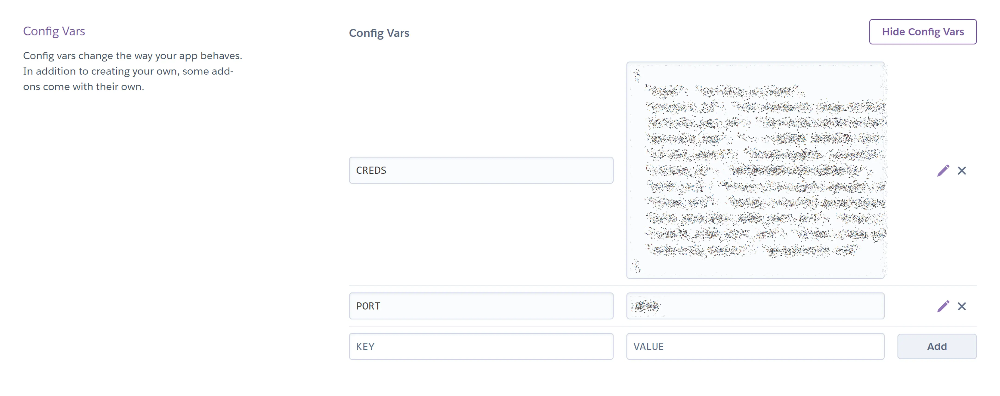

# Cuisine Command

Cuisine Command is a Python command line application for use by a takeaway restaurant. It runs in a Heroku-hosted mock terminal designed by Code Institute. It uses Google Cloud-provided APIs to communicate with Google Sheets worksheets. The program would be operated by an employee of the restaurant, taking customer orders over a phone call.

The restaurant is assumed to be collection only, rather than delivery, and to take payment at time of collection. The customer is assumed to already be aware of what dishes are sold and their assigned dish numbers, either through possession of a hard copy menu leaflet or through perusal of a separate customer-facing website. However, all an assessor will need to know is that the available dish numbers are currently 1 through 15.

[The deployed project can be found here.](https://cuisine-command-7bf263233a6e.herokuapp.com/)

## Features/How to use

### 1. Title banner & Loading menu

When the program first runs, the green title banner is printed across the top. It adds some visual interest and displays the program name, without being distracting from the more important terminal contents below.

With APIs, the menu is retrieved from Google Sheets. It is converted into a dictionary. When the process begins, "Menu is loading" is printed. When the short process has completed, "Menu has loaded" is printed. (Through testing, I found that fetching columns and using a zip method was multiple seconds faster than fetching rows and using a for loop.)

The menu is located in a 'menu' worksheet of the food_orders spreadsheet. This means that it would be simple for the restaurant to expand or alter the menu without the developer's help. They should be mindful though to begin the new dish description with a # and an appropriate number, else searching by dish number could be impeded.

### 2. Order input & Live suggestions

Image A - The customer on the phone tells the restaurant worker/program user the dish number of the first item they want to order. The user presses # and then that number and a dropdown of suggestions appears. (Currently, the existing dish numbers are 1 through 15.) If the customer did not know the dish number, pressing # should allow the user to see a dropdown of the whole menu with each item's dish number.

Image B - The user presses the down arrow to highlight the correct menu item.

Image C - The user presses Enter and is asked for the customer's next desired product.

Image D - If the user enters something that is not a valid menu item (i.e., does not exactly match any menu_items dictionary key), red text informs the user of the problem. The next product is again asked for.

Image E - The exemption to that rule is when the user enters just the letter x . This should be done when the customer has no more items they wish to order, and is necessary for ending the loop and progressing to the next stage.

x is a relatively intuitive character for exiting the loop, as clicking an x symbol is frequently associated with closing or leaving something. The fact that it is an alphabetical character is not problematic in this particular case, because all other valid inputs a. start with a number and b. are chosen from specific options.

Image F - However, if x is entered before any menu items have been entered, red text informs the user that an order requires at least one ordered item. The user is again prompted to enter one.

### 3. Name input

Image A - The customer tells the restaurant worker/program user their surname, for meal collection purposes.

Image B - The user types in the name and presses Enter. Only letters will be valid (not numbers, spaces, or punctuation). If the customer gives a double-barrelled surname, a hyphen should not be inputted. PascalCase can be used instead.

Accurate spelling of the customer's name is not very important, as long as the input is a reasonable approximation of the sound of the name (because it is solely for them to say their name when they pick up their order).

Image C - If invalid characters are entered, or if no name at all is entered, red text alerts the user. The user is again prompted to enter a name.

### 4. Order summary & Worksheet recording

Finally, a table-form summary of the order is printed, reminding the restaurant staff which items they should now cook or otherwise prepare for sale. In the background, the prices of the items have already been added together, and the total cost is included in this summary.

A record of this order has additionally been sent to a 'record' worksheet in the food_orders spreadsheet, contributing to the restaurant's monitoring of their business operations.

If the user wishes to repeat the process for another customer shortly after, they can simply click an orange "RUN PROGRAM" button above the mock terminal to run the program again from the beginning.

## Development

### Hooking up APIs

I created a GitHub repository from Code Institute's [project template](https://github.com/Code-Institute-Org/p3-template), cloned my repository in VS Code, established a virtual environment, and created the Google Sheets spreadsheet. I created a Google Cloud project, enabled a Google Drive API, created credentials and a service account, and created a JSON key. I also enabled a Google Sheets API. I dragged the file of the JSON key into my workspace, renamed it 'creds', copied the client email address from it, shared my spreadsheet to that address, and named `creds.json` in the gitignore. I then added the required code in `run.py` to set up the APIs for interaction between the Python script and the spreadsheet.

### The Menu Saga

My menu has evolved several times. At first, it was a class with a large number of instances. Then, it was a dictionary in a separate `menu.py` file, imported into `run.py`. Now, it is two columns of data in a worksheet, retrieved and converted into a dictionary when the script is run.

### Prompt Toolkit

Discovering `prompt_toolkit` was the product of much research and experimentation, with several alternatives being tried before finding the solution that matched the functionality I had imagined regarding live suggestions and autocompletion. To avoid possibly impacting my workspace with lots of installs that might end up not being used in the project, I experimented in a new window with its own virtual environment and Python scripts.

## Testing

I tested frequently during development by running the code to see how it behaved, making adjustments where needed.

Towards the end of development, I passed my code to a Python linter and removed every issue found.

A majority of those fixes were simply splitting a comment onto the next line or adding a second blank line between functions. Additionally, I recreated the ASCII art to get it narrow enough, addressed bare exceptions, and changed the logic `while quit == False` first to `if not quit` (on the apparent advice of the linter) then to `while not quit` after I found that it had broken my code.

## Deployment to Heroku

The deployment was straightforward. I populated my `requirements.txt` with the result of a `py -m pip freeze` in the terminal, I made sure my GitHub repository was up to date, then in Heroku, I created a new app, chose to deploy from my GitHub and selected its appropriate repository, copied in the credentials from the git-ignored `creds.json` and added the right port number, and specified the suitable buildpacks.

Here is the deployed project: [Cuisine Command](https://cuisine-command-7bf263233a6e.herokuapp.com/)

After deployment, I continued testing, making and committing changes, and re-deploying to Heroku, until I was satisfied enough to submit the project.

## Improvement for Resubmission

### Knowing how to proceed

I received assessor feedback that the UX was unclear. I had previously presumed that the step-by-step, screenshot-illustrated instructions in the readme would be looked at before the deployed project was tested, and that a hypothetical real-world user would similarly be trained in its use before touching it. However, I understand that it is desirable for adequate direction to also be given on screen during use - for example, in case the user partially forgets what to do and becomes delayed during a customer call.

I have now addressed this by adding instructional print statements into the Order class's `take_order`and `take_name` methods. The on-screen instructions will ensure that the user knows what they need to, when they need to, about how to:

- quickly input each menu item of the order (via the dish numbering and autocompletion - now improved by starting with # to see the whole menu, as described below)

- move on when all chosen items have been inputted (by entering x)

- and examples of things to avoid to input a valid name - only certain predictable inclusions are named explicitly but the potential error message says more broadly that the input must be letters only, which would also cover accidental key presses such as numbers and punctuation marks.

### Clarity of error message

The feedback also said that "Error handling...messaging is not clear to the user on the issue that their input is causing". I believe that this will have been closely related to the first problem. In other words, that neither the brief instruction before nor the error message after were sufficient to make clear what the user had been supposed to do. Therefore, the added instructions will have alleviated this issue also.

However, the specificity of one of the error messages has been directly improved too, now reading "Input did not match any menu item" - rather than merely saying that the input was invalid. This can be seen on or near line 78 of `run.py`, within the `take_order` method.

### Visibility of menu

The feedback additionally noted that ideally the menu would be easier to access, which I took to mean that being able to see the full menu at once from within the program would be advantageous.

I came up with the solution of adding a # symbol (used as shorthand for "number") before each dish number in the 'menu' worksheet of the `food_orders` spreadheet. This should mean that typing # when asked to input a menu item will cause `prompt_toolkit`'s live autocompletion to display a suggestions dropdown of the entire menu, not just the items beginning with 1 or another number. The user should therefore be able to see for themselves what numbers correspond to what dishes and select the desired menu items more easily. This improved functionality is included in the instructional print messages, as mentioned above.

## Credits

- Code Institute's [Project 3 Template](https://github.com/Code-Institute-Org/p3-template) was used to create the mock terminal for the deployed project to run in.

- [Rahul Lakhanpal](https://github.com/rahulkp220), my Code Institute mentor, provided general support in solidifying my ideas and tackling the project's challenges. His largest specific influence on the project was pointing out that a menu in a Python file could only be amended by the developer and that a menu drawn from a worksheet would avoid that problem. He also directed me towards ASCII Art Generator, Colorama, and Tabulate.

- How to set up APIs for communication with Google Sheets was learnt from Code Institute's "Love Sandwiches" walkthrough project.

- Code Institute's [Python Linter](https://pep8ci.herokuapp.com/) was used to check my code for issues.

- My method of converting the menu from worksheet data into a Python dictionary was partially based on [this Stack Overflow forum page](https://stackoverflow.com/questions/48071406/convert-columns-of-an-excel-into-dictionary-in-python).

- [ASCII Art Generator](https://www.ascii-art-generator.org/) was used to create the title banner.

- How to print ASCII art was learnt from [this Stack Overflow forum page](https://stackoverflow.com/questions/23623288/print-full-ascii-art).

- [Colorama](https://pypi.org/project/colorama/) was used to color the title banner green and to color validation failure messages red.

- How to auto-reset color after Colorama use was learnt through [this Stack Overflow forum page](https://stackoverflow.com/questions/43649051/a-way-to-not-have-to-reset-the-color-style-in-colorama-every-time) but is actually also in its PyPI documentation.

- [Tabulate](https://pypi.org/project/tabulate/) was used to present the order summary.

- [This YouTube video](https://youtu.be/u51Zjlnui4Y) about Colorama and [this YouTube video](https://youtu.be/Yq0lbu8goeA) about Tabulate were also consulted, complementing their official PyPI documentation.

- [Prompt Toolkit](https://pypi.org/project/prompt-toolkit/) was used to provide live suggestions and autocompletion when inputting menu items. How to use Prompt Toolkit for these purposes was learnt from [this section of its documentation](https://python-prompt-toolkit.readthedocs.io/en/stable/pages/asking_for_input.html#autocompletion
).

- How to clear the terminal was learnt from [this web page](https://www.geeksforgeeks.org/clear-screen-python/).

- [Tiny PNG](https://tinypng.com/) was used to optimize the images in this README.

- `screencaps/am-i-responsive.webp` was created with [Am I Responsive](https://ui.dev/amiresponsive).

- `screencaps/take-order.webp` , `take-name.webp` , and `config-vars.webp` were edited in Microsoft PowerPoint.

- The menu items and prices were picked from a local restaurant's real menu.
